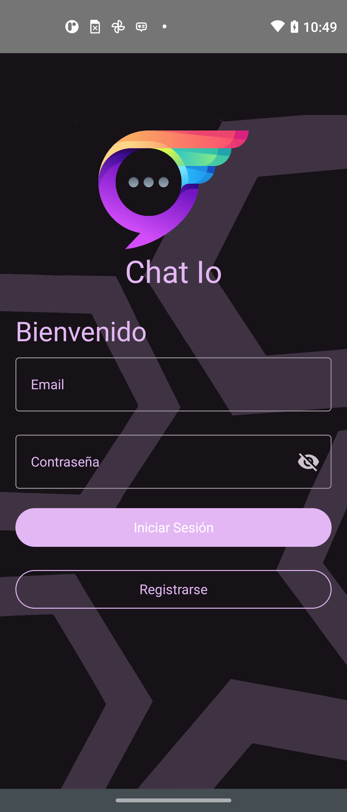
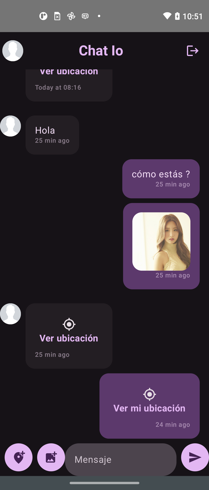
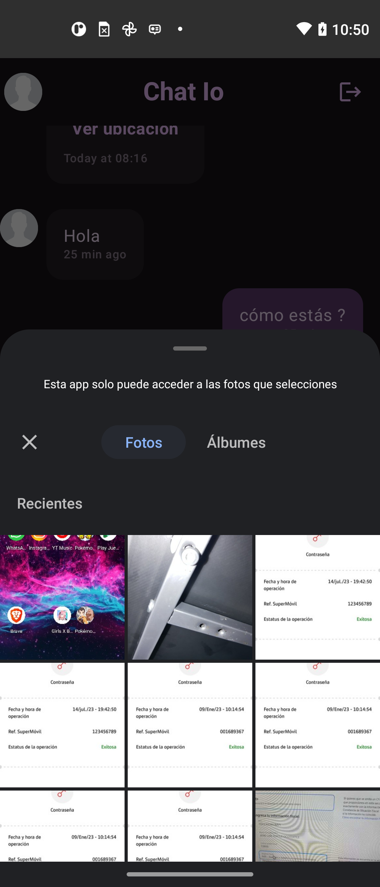

## Chat IO
**Chat IO** es una aplicación de chat en tiempo real que permite a los usuarios comunicarse entre sí mediante mensajes de texto,imágenes y ubicación.

### Funcionalidades
* **Registro e inicio de sesión:**
    * Los usuarios pueden crear una cuenta nueva con correo electrónico y contraseña.
    * Los usuarios pueden iniciar sesión con su correo electrónico y contraseña.
* **Chat en tiempo real con Firebase:**
    * Los usuariospueden enviar mensajes de texto entre sí.
    * Los usuarios pueden enviar imágenes entre sí.
    * Los usuarios pueden compartir sus coordenadas de ubicación entre sí.
* **Multiusuario:**
    * La aplicación admite varios usuarios que pueden chatear entre sí.

### Video

### Capturas de pantalla
**Login**

**Chat**

**Galería**
